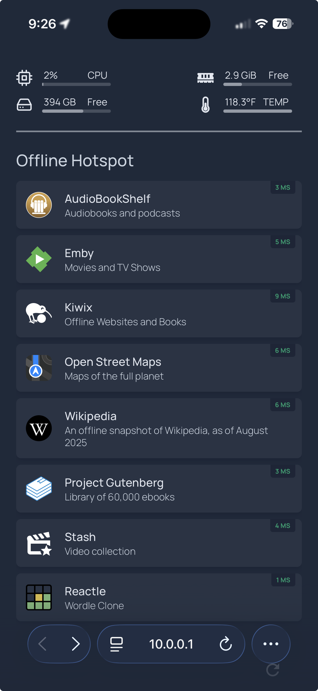

# Offline Hotspot

Offline Hotspot is a portable, low power personal server designed for offline and emergency scenarios. It consists of a Raspberry Pi 5, 1TB SD card, and a custom 3D printed enclosure.It's entirely self-contained and needs no Internet access.

It runs its own wifi access point and exposes the following applications through your browser:

- **Audiobookshelf**: A collection of podcasts and audiobooks
- **Emby**: A collection of movies
- **Kiwix**: An archive of websites related to software development, prepping, medicine, and self-sufficiency.  
- **Open Street Maps:** World maps as of November 2025 (with 3D buildings!)
- **Wikipedia**: A snapshot of the entirety of Wikipedia from August 2025
- Project Gutenberg: 60K ebooks
- Stash: For... videos.
- Reactle: A Wordle clone

## **How to Use**
- Connect the USB-C port to power and wait 2 minutes for it to boot
- From a phone, tablet, or computer, join the "OfflineHotspot" wifi network.
- Open a browser and navigate to http://10.0.0.1. Alternatively, there is an RFID chip on the top of the device (near the slanted vents), which you can scan with your phone.

## Authentication
Most applications do not require authentication, but a few do (Emby, Stash). Use the credentials root / Greenlake!

## Notes
- The system is resilient to being unplugged randomly.
- Note that Offline Hotspot is meant to be used for offline (non-Internet connected) scenarios. Security is far less of a concern.

## Hacking
This is not meant to be a static product. Offline Hotspot runs Raspbian (Debian) and can be hacked to your heart's content. 

- SSH into the device with the above credentials.
- **OS and App updates:** You'll need the Ethernet to be connected to your network. Then, SSH in. Run update.sh to update the OS, firmware, and packages. All apps are Dockerized. Edit ~/offlinehotspot/docker-compose.yml and then rerun Docker with the command: "docker compose up -d"
- Movies, maps, books, and videos are all stored underneath /media/.
	- **Maps**: You can get updated .mbtiles from openfreemap.org. On their Github page (https://github.com/hyperknot/openfreemap), look for instructions under the "Full Planet Downloads" section. Place the .mbfiles under /media/maps/.
	- **Movies:** Copy kids movies to /media/movies/kids/. Copy standup comedy to /media/movies/comedy/. Otherwise, copy movies to /media/movies/movies/. Then in Emby, click the gear icon -> Library -> Scan Library Files to rebuild the index.
- The homepage is powered by GetHomePage. Configs are under ~/offlinehotspot/homepage/.
- You can connect a keyboard, mouse, and monitor (via micro HDMI).

Known issues
- **Emby:** Watching some videos may peg the CPU. You might have to tweak Emby's transcoding settings or disable transcoding.
- Stash: I wasn't able to get scraping / metadata working correctly.

## Project Ideas
- Add your own movies and TV shows 
- Add additional Docker apps (e.g. games)
